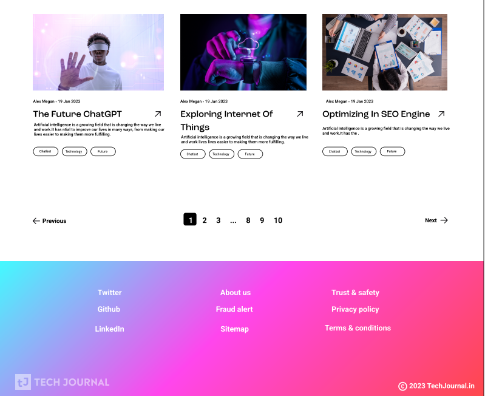

# UI Design Repository

This repository contains UI design files for various projects. Each project is organized into its own folder, with separate files for each screen or page of the interface.

# Getting Started

To access the UI design files, simply clone this repository to your local machine using the following command:

```ruby
git clone https://github.com/abhijeetsalve01/UI_Design.git
```

Once you've cloned the repository, you can open the design files in your preferred design software (such as Adobe XD or Figma) to view and edit them.


# Contributing


If you'd like to contribute to this repository, feel free to submit a pull request with your changes.


# License


This repository is licensed under the MIT License, which means that you are free to use, copy, and modify the design files for both personal and commercial purposes. However, please note that we are not responsible for any issues or damages that may arise from using the design files in your own projects.


# Contact


If you have any questions or issues with this repository, please feel free to contact us at salveabhijeet01@gmail.com.

# Sample Work

# JobBoard


# TechJournal





